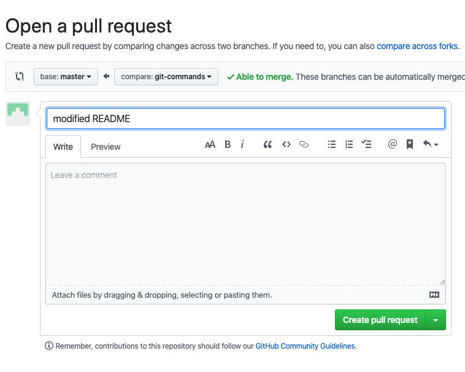

# GitHub Session for Technical Writers

This is a dummy repository to practice making a Pull Request (PR).

## Table of Contents

The following sections explain the tasks that you need to perform to create a PR:

* [Step 1: Create a Local Copy of the Remote Repository](#step-1-create-a-local-copy-of-the-remote-repository)
* [Step 2: Create a New Branch](#step-2-create-a-new-branch)
* [Step 3: Create a Pull Request](#step-3-create-a-pull-request)
* [Step 4: Update your Local Copy of the Remote Repository](#step-4-update-your-local-copy-of-the-remote-repository)

## Step 1: Create a Local Copy of the Remote Repository

To create a local copy of a remote repository:

1. Go to the GitHub repository.
1. Click the  button located on the top right of the GitHub repository.

    You have a copy of the repository on your GitHub account.

1. Go to your copy of the repository in GitHub (forked repository).
1. Click the  button. 
1. Click the  button to copy the repository’s URL address.

   >**Note**: If you enabled the SSH Keys, click **Use SSH** prior to copy the repository's URL address. 
1. Open your terminal application.
1. Change the current working directory to the location where you want to store the repository’s contents using the change directory (**cd**) command.
1. Enter `git clone`, and then paste the URL you copied in Step 5. 

[⇧ back to top](#table-of-contents)

## Step 2: Create a New Branch
You need to create a new branch to commit the changes you make to your local copy of the GitHub repository. 

To create a new branch and commit changes to it:

1. Open your terminal application.
1. Change the current working directory to the location where you stored the repository’s contents using the change directory (**cd**) command.
1. Create a new branch:
   
   ```
    git checkout -b name-of-your-branch
   ```
   
     A message informing you that git switched to the branch `name-of-you-branch appears`.
   
   > **Suggestion:** Create a meaningful name for your branch so that you can easily remember what you modified or added to the repository.

   Once you have the new branch, you can change, create, or modify files in the repository. 

1. Stage your changes:

   ```
    git add .
   ```
   or 
   ```
   git add name-of-file.md
   ```
   >**Note**: The best practice is to use the name of the file you modified.

1. Commit your changes:

   ```
    git commit -m "added/modified a file"
   ```
   >**Note:** Replace the text enclosed in `"..."` with some brief explanation of the additions or modifications you performed to the local copy of the repository.

[⇧ back to top](#table-of-contents)

## Step 3: Create a Pull Request
Finally, you need to push your changes to the local copy of the repository created in the [previous step](#step-2-create-a-new-branch) and create a PR in the GitHub repository that you forked.

To create a a Pull Request in the forked GitHub repository:

1. Open your terminal application.
1. Change the current working directory to the location where you stored the repository’s contents using the change directory (**cd**) command.
1. Verify that you are inside the branch you created:

   ```
    git status
   ```

   >**Note:** You can move from the current branch to a different one by running the command `git branch name-of-you-branch`.

1. Push your changes (commited in the branch you created) to the master branch of the original GitHub repository:

   ```
    git push --set-upstream origin name-of-you-branch
   ```

1. Go to your copy of the repository in GitHub (forked repository).
1. Click the  button.

   You see a window similar to this:

    

1. Enter a comment explaining the additions or modifications you created in the **Leave a comment** field.
1. Click the  button.

[⇧ back to top](#table-of-contents)

## Step 4: Update your Local Copy of the Remote Repository

It is important to keep your own copy of the repository up to date. It prevents you from having merge conflicts when creating a pull request.

You need to add the original repository (the one you forked) to your list of tracked repositories so that you can merge the original repository's master branch into your local copy's master branch. 

To update your local copy of the GitHub repository:

1. Open your terminal application.
1. Change the current working directory to the location where you stored the repository’s contents using the change directory (**cd**) command.
1. Switch to you local copy's master branch:
   
   ```
    git checkout master
   ```

1. Add the original repository's GitHub address to your tracked repositories.

   ```
    git remote add upstream https://github.com/original-owner-username/original-repository.git
   ```

   >**Note**: Remember to use the SSH URL if you are using SSH Keys. 

   >**Note**: To view your list of tracked repositories, run the command `git remote -v`.


1. Obtain the latest version of the original repository's master branch:

   ```
    git fetch upstream
   ```

   Git fetches the branch *upstream/master*.

1. Merge the branch upstream/master into your local master branch:

   ```
    git merge upstream/master
   ```

1. (Optional) Update your GitHub copy:

    ```
     git push
    ```

If you are working on a branch that is different from master, then you can also merge the master branch into it.

To merge the master branch into another branch:

1. Switch to your branch:

   ```
     git branch name-of-your-branch
    ```

1. Merge the master branch into the *name-of-your-branch* branch:

   ```
     git merge master
    ```


[⇧ back to top](#table-of-contents)..